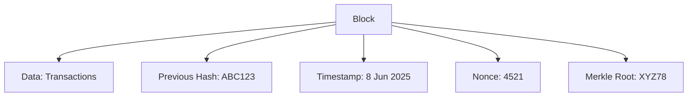

# Blockchain Basics and Simulations

**This submission is part of the BlockseBlock Blockchain Dev Internship Task 1.**

**Original questions and instructions can be found here:**
[BlockseBlock Internship Task 1 Questions](https://docs.google.com/document/d/1QK6_qp6h76x9-cmN_HpTUnNEQDSkH6SEYKddgnCNMEI/edit?tab=t.0#heading=h.kgcu4b9m2vy3)

## 1. What is a Blockchain?
A blockchain is a digital ledger or record book that securely stores data in blocks, which are linked together in a chain. Each block contains a unique fingerprint (hash) of the previous block, making the entire chain tamper-resistant. Once information is added to a block and confirmed, it becomes very difficult to alter without changing all subsequent blocks. This structure ensures transparency, security, and trust, as every participant in the network can verify the data. Blockchains are decentralized, meaning no single entity controls the data, and all changes are visible to everyone. This makes blockchain ideal for applications where data integrity and trust are crucial.

## 2. Real-Life Use Cases
- **Ration Card System:** Blockchain can track food supply from farmers to shops, preventing fake entries and reducing corruption.
- **Land Records:** Land ownership can be stored on blockchain instead of paper documents, reducing fraud and making transfers transparent.

## 3. Block Structure Example

## 4. How the Merkle Root Helps Verify Data Integrity
Imagine a family tree where each member's name is hashed. The Merkle root is like the family's surname—it represents all transactions in the block. If even one transaction changes, the Merkle root changes, alerting everyone to tampering. This ensures data integrity and quick verification.

## 5. What is Proof of Work and Why Does it Require Energy?
**Like Solving a Puzzle:**
Miners compete to solve a math puzzle (like Sudoku). The first to solve it gets to add the block and earn rewards. This process requires a lot of electricity because many computers race to solve the puzzle at the same time.

## 6. What is Proof of Stake and How Does it Differ?
**Like a Fixed Deposit:**
Instead of mining, validators are chosen based on how many coins they "lock" (stake). More stake = higher chance to validate. This method saves energy because no puzzle-solving is needed.

## 7. What is Delegated Proof of Stake and How Are Validators Selected?
**Like Voting for a Leader:**
People vote for a few trusted validators (like electing class monitors). These validators take turns to add blocks. DPoS is faster and cheaper than PoW/PoS.

---

# Practical Part (Code-Based Tasks)

## 1. Block Simulation in Code
- **File:** [blockchain.py](./blockchain.py)
- **Objective:** Build a basic blockchain with 3 linked blocks.
- **Challenge:** Change the data of Block 1 and see how it affects the chain.

## 2. Nonce Mining Simulation
- **File:** [mining.py](./mining.py)
- **Objective:** Simulate Proof-of-Work by mining a block that meets a difficulty condition.
- **Output:** Prints nonce attempts and time taken.

## 3. Consensus Mechanism Simulation
- **File:** [consensus.py](./consensus.py)
- **Objective:** Simulate and compare PoW, PoS, and DPoS logic in code.
- **Output:** Prints selected validator and consensus method used.

---

Each file contains comments and print statements to help you understand the output and logic. Run them with Python to see blockchain concepts in action! 